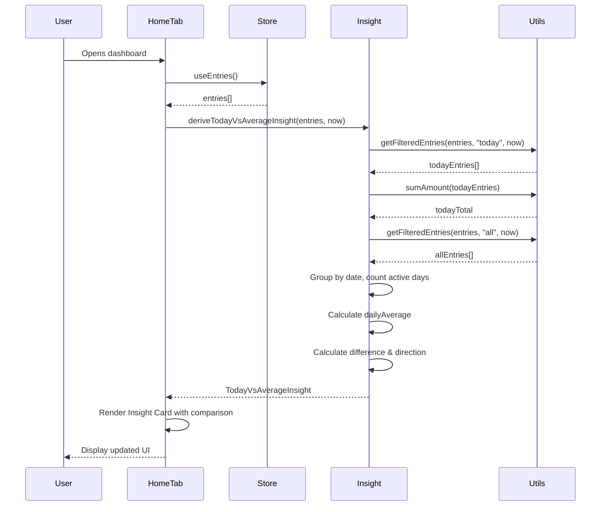
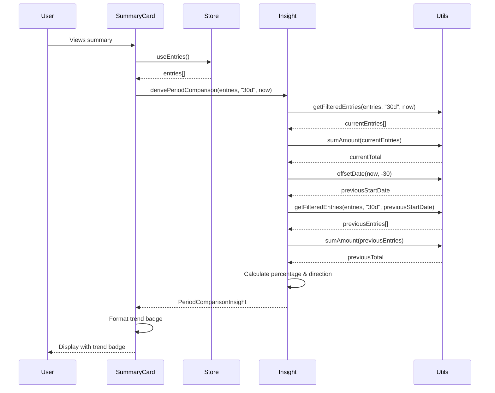
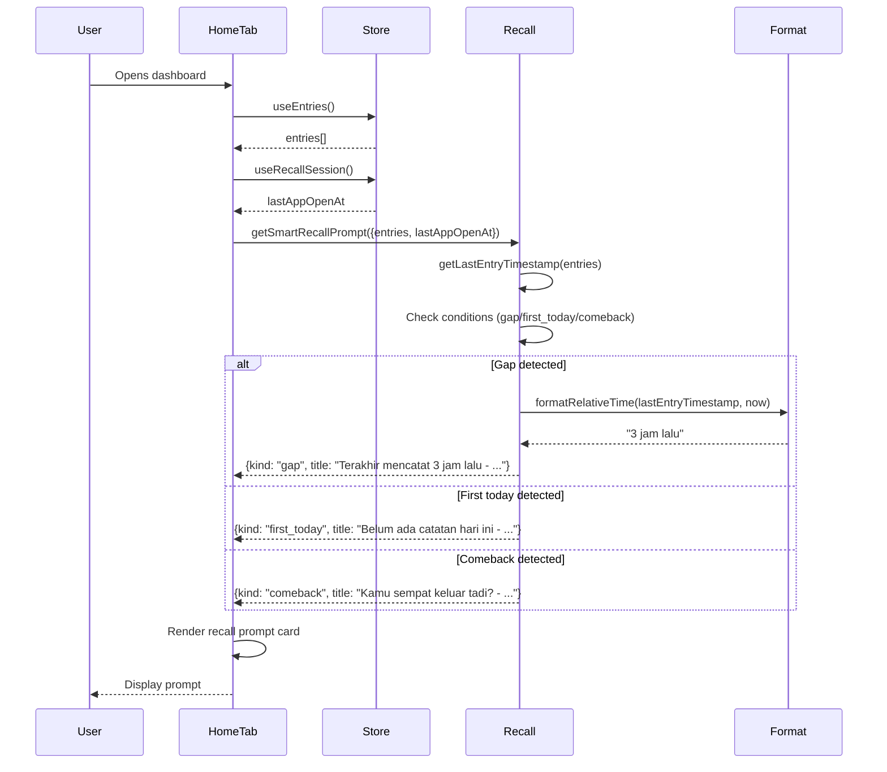

# Technical Design Document: UX Critical Improvements

## Overview

This design addresses three critical UX improvements for the KeMana expense tracking application:

1. **Today vs Average Insight**: Display today's spending compared to daily average, helping users understand if today is a high or low spending day
2. **Actionable Memory Recall**: Replace passive recall prompts with active, question-based prompts that trigger memory more effectively
3. **Period Comparison Context**: Add trend badges showing percentage change compared to previous periods, making large numbers more meaningful

These improvements target the core user behavior pattern: logging expenses retrospectively rather than in real-time. The design integrates seamlessly with existing architecture while maintaining performance and code quality standards.

## Architecture

### System Context

The improvements integrate into the existing KeMana dashboard architecture:

```
┌─────────────────────────────────────────────────────────────┐
│                     Home Dashboard                           │
│  ┌───────────────────────────────────────────────────────┐  │
│  │           SummaryHeroCard                             │  │
│  │  - 30-day total                                       │  │
│  │  - Transaction count                                  │  │
│  │  - Average per day                                    │  │
│  │  + NEW: Trend Badge (period comparison)              │  │
│  └───────────────────────────────────────────────────────┘  │
│                                                              │
│  ┌───────────────────────────────────────────────────────┐  │
│  │           Insight Card                                │  │
│  │  - Current status                                     │  │
│  │  - Top category                                       │  │
│  │  + NEW: Today vs Average comparison                  │  │
│  └───────────────────────────────────────────────────────┘  │
│                                                              │
│  ┌───────────────────────────────────────────────────────┐  │
│  │           Smart Recall Prompt                         │  │
│  │  + NEW: Question-based wording                       │  │
│  │  + NEW: Relative time formatting                     │  │
│  └───────────────────────────────────────────────────────┘  │
└─────────────────────────────────────────────────────────────┘
         │                    │                    │
         ▼                    ▼                    ▼
┌─────────────────┐  ┌─────────────────┐  ┌─────────────────┐
│  insight.ts     │  │  recall.ts      │  │ kemana-utils.ts │
│  (calculations) │  │  (prompts)      │  │ (date/format)   │
└─────────────────┘  └─────────────────┘  └─────────────────┘
         │                    │                    │
         └────────────────────┴────────────────────┘
                              │
                              ▼
                    ┌─────────────────┐
                    │  Zustand Store  │
                    │  (entries)      │
                    └─────────────────┘
```

### Data Flow

1. **Entry Data**: Flows from Zustand store → utility functions → calculations → UI components
2. **Calculations**: Performed in utility modules (insight.ts, recall.ts) to maintain separation of concerns
3. **State Management**: Uses existing Zustand granular hooks pattern to minimize re-renders
4. **Rendering**: React components consume calculated data and render UI

### Key Design Decisions

1. **Calculation Location**: All new calculations live in existing utility modules (insight.ts, recall.ts) rather than components
2. **State Management**: No new Zustand state slices needed; calculations derive from existing entries
3. **Performance**: Calculations memoized at component level using React.useMemo
4. **Compatibility**: Extends existing functions rather than replacing them to maintain backward compatibility

## Components and Interfaces

### 1. Today vs Average Calculation

**New Function**: `deriveTodayVsAverageInsight`

Location: `apps/web/src/lib/dashboard-page-utils/insight.ts`

```typescript
export interface TodayVsAverageInsight {
  todayTotal: number;
  dailyAverage: number;
  difference: number;
  direction: "up" | "down" | "neutral";
  hasData: boolean;
  hasSufficientHistory: boolean;
}

export function deriveTodayVsAverageInsight(
  entries: Entry[],
  now: Date = new Date()
): TodayVsAverageInsight
```

**Algorithm**:
1. Filter entries for today using `getFilteredEntries(entries, "today", now)`
2. Calculate `todayTotal` using `sumAmount(todayEntries)`
3. Filter historical entries (exclude today) to get data range
4. Group historical entries by date, count active days (days with transactions)
5. Calculate `dailyAverage = totalHistorical / activeDays`
6. Calculate `difference = todayTotal - dailyAverage`
7. Determine direction: "up" if difference > 0, "down" if < 0, "neutral" if === 0
8. Set `hasSufficientHistory = activeDays >= 3` (minimum for meaningful average)

### 2. Period Comparison Calculation

**New Function**: `derivePeriodComparison`

Location: `apps/web/src/lib/dashboard-page-utils/insight.ts`

```typescript
export interface PeriodComparisonInsight {
  currentTotal: number;
  previousTotal: number;
  percentageChange: number;
  direction: "up" | "down" | "neutral";
  hasData: boolean;
  hasPreviousData: boolean;
}

export function derivePeriodComparison(
  entries: Entry[],
  preset: DateFilterPreset = "30d",
  now: Date = new Date()
): PeriodComparisonInsight
```

**Algorithm**:
1. Get current period entries using `getFilteredEntries(entries, preset, now)`
2. Calculate `currentTotal` using `sumAmount(currentEntries)`
3. Calculate previous period start date: `offsetDate(now, -windowDays * 2)` to `offsetDate(now, -windowDays)`
4. Get previous period entries using `getFilteredEntries` with offset date
5. Calculate `previousTotal` using `sumAmount(previousEntries)`
6. Calculate `percentageChange = Math.round(Math.abs((currentTotal - previousTotal) / previousTotal) * 100)`
7. Handle edge cases: if previousTotal === 0, set percentageChange to null
8. Determine direction based on currentTotal vs previousTotal

### 3. Relative Time Formatting

**New Function**: `formatRelativeTime`

Location: `apps/web/src/app/recall.ts`

```typescript
export function formatRelativeTime(timestamp: number, now: number = Date.now()): string
```

**Algorithm**:
1. Calculate `diffMs = now - timestamp`
2. If `diffMs < 60 * 60 * 1000` (< 1 hour): return `"${Math.floor(diffMs / 60000)} menit lalu"`
3. If `diffMs < 24 * 60 * 60 * 1000` (< 24 hours): return `"${Math.floor(diffMs / 3600000)} jam lalu"`
4. If `diffMs < 48 * 60 * 60 * 1000` (< 48 hours): return `"kemarin"`
5. Else: return `"${Math.floor(diffMs / 86400000)} hari lalu"`

### 4. Updated Recall Prompts

**Modified Function**: `getSmartRecallPrompt`

Location: `apps/web/src/app/recall.ts`

Changes to return values:
- Gap recall: `"Terakhir mencatat ${formatRelativeTime(lastEntryTimestamp)} - Ingat ada pengeluaran setelah itu?"`
- First today: `"Belum ada catatan hari ini - Ada transaksi yang belum dicatat?"`
- Comeback: `"Kamu sempat keluar tadi? - Ada pengeluaran yang belum dicatat?"`

### 5. UI Component Updates

**HomeTabContent.tsx**:
- Add `todayVsAverageInsight` prop
- Display comparison in Insight Card section
- Format: "Hari ini vs Rata-rata: Rp{difference} {arrow}"

**SummaryHeroCard.tsx**:
- Add optional `trendBadge` prop
- Display badge below period label
- Format: "{arrow} {percentage}% dibanding bulan lalu"

## Data Models

### Existing Models (No Changes)

```typescript
// From @kemana/core/types
interface Entry {
  id: string;
  text: string;
  amount: number;
  category: string;
  date: string; // YYYY-MM-DD format
  paymentMethod: string;
  createdAt: string; // ISO timestamp
  updatedAt: string;
  splitCount?: number;
}
```

### New Calculation Result Types

```typescript
// Today vs Average
interface TodayVsAverageInsight {
  todayTotal: number;
  dailyAverage: number;
  difference: number;
  direction: "up" | "down" | "neutral";
  hasData: boolean;
  hasSufficientHistory: boolean;
}

// Period Comparison
interface PeriodComparisonInsight {
  currentTotal: number;
  previousTotal: number;
  percentageChange: number | null;
  direction: "up" | "down" | "neutral";
  hasData: boolean;
  hasPreviousData: boolean;
}
```

### Component Prop Extensions

```typescript
// SummaryHeroCard additional props
interface SummaryHeroCardProps {
  // ... existing props
  trendBadge?: {
    label: string;
    tone: "up" | "down" | "neutral";
  } | null;
}

// HomeTabContent additional props
interface HomeTabContentProps {
  // ... existing props
  todayVsAverageInsight: TodayVsAverageInsight | null;
}
```


## Correctness Properties

*A property is a characteristic or behavior that should hold true across all valid executions of a system—essentially, a formal statement about what the system should do. Properties serve as the bridge between human-readable specifications and machine-verifiable correctness guarantees.*

### Property Reflection

After analyzing all acceptance criteria, I identified the following redundancies:

1. **Currency formatting properties (1.1, 1.2, 1.7, 6.1)**: These all test the same underlying formatting function. Combined into Property 1.
2. **Indicator direction properties (1.4, 1.5, 3.2, 3.3)**: These test the same comparison logic. Combined into Property 2.
3. **Time formatting properties (2.6, 2.7, 2.8)**: These test different ranges of the same formatter. Combined into Property 3.
4. **Calculation properties (1.3, 4.1, 4.2)**: Today total and average calculations are distinct but related. Kept separate for clarity.
5. **Period comparison properties (3.1, 3.4, 3.10, 4.4)**: Combined into Property 6 for comprehensive period comparison testing.

The following properties provide unique validation value without redundancy:

### Property 1: Today Total Calculation

*For any* set of entries and any date, calculating today's total should equal the sum of all entry amounts where the entry date matches the given date.

**Validates: Requirements 1.1, 4.1**

### Property 2: Daily Average Excludes Zero-Transaction Days

*For any* set of historical entries, the daily average should be calculated by dividing the total amount by the count of unique dates that have at least one transaction (excluding days with zero transactions).

**Validates: Requirements 1.2, 4.2, 4.3**

### Property 3: Comparison Direction Correctness

*For any* two amounts (today vs average, or current vs previous period), the direction indicator should be "up" when the first amount exceeds the second, "down" when the first is less than the second, and "neutral" when they are equal.

**Validates: Requirements 1.4, 1.5, 3.2, 3.3**

### Property 4: Difference Calculation Accuracy

*For any* two amounts being compared, the displayed difference should equal the absolute value of (first amount - second amount).

**Validates: Requirements 1.3, 1.7**

### Property 5: Relative Time Formatting

*For any* timestamp and current time, the relative time formatter should produce Indonesian text in the format: minutes for differences < 1 hour, hours for differences < 24 hours, "kemarin" for differences < 48 hours, and days for longer differences.

**Validates: Requirements 2.5, 2.6, 2.7, 2.8**

### Property 6: Period Comparison Window Consistency

*For any* date filter preset and reference date, the previous period window should have the same length as the current period window, and the percentage change should be calculated as `Math.abs((current - previous) / previous) * 100` rounded to whole numbers.

**Validates: Requirements 3.1, 3.4, 3.8, 3.10, 4.4**

### Property 7: Timezone Consistency

*For any* calculation involving "today", the system should use the same timezone (device local timezone) consistently across all date comparisons and filtering operations.

**Validates: Requirements 4.8**

### Property 8: Currency Precision

*For any* currency calculation, the result should maintain precision to 2 decimal places before formatting, and the formatted output should use Indonesian Rupiah format with period separators for thousands.

**Validates: Requirements 4.9, 6.1**

### Property 9: Negative Amount Handling

*For any* set of entries including negative amounts (refunds), all calculations (totals, averages, comparisons) should include negative amounts correctly in the arithmetic operations.

**Validates: Requirements 8.7**

### Property 10: Graceful Error Handling

*For any* calculation function, when provided with invalid or edge-case inputs (empty arrays, null values, NaN results), the function should return a valid result object with appropriate flags (hasData: false, hasSufficientHistory: false) rather than throwing errors.

**Validates: Requirements 8.4, 8.10**

## Error Handling

### Input Validation

All calculation functions validate inputs before processing:

```typescript
// Example validation pattern
function deriveTodayVsAverageInsight(entries: Entry[], now: Date = new Date()): TodayVsAverageInsight {
  // Validate entries array
  if (!Array.isArray(entries)) {
    return createEmptyInsight();
  }
  
  // Validate date
  if (!now || isNaN(now.getTime())) {
    now = new Date();
  }
  
  // Continue with calculation...
}
```

### Edge Cases

1. **Empty Data**: Return insight objects with `hasData: false` flag
2. **Insufficient History**: Return `hasSufficientHistory: false` when < 3 days of data
3. **Zero Division**: Check `previousTotal > 0` before calculating percentage
4. **Invalid Dates**: Default to `new Date()` if provided date is invalid
5. **NaN Results**: Check `isFinite()` before using calculated values
6. **Large Numbers**: Use existing `formatAmountIDR` which handles large numbers correctly

### Error Boundaries

Component-level error handling:

```typescript
// In HomeTabContent
const todayVsAverageInsight = useMemo(() => {
  try {
    return deriveTodayVsAverageInsight(entries, now);
  } catch (error) {
    console.error("Failed to calculate today vs average:", error);
    return null;
  }
}, [entries, now]);
```

### Fallback UI

When calculations fail or data is insufficient:

- **Today vs Average**: Show "Belum cukup data untuk perbandingan" (Not enough data for comparison)
- **Period Comparison**: Omit trend badge entirely
- **Recall Prompts**: Fall back to generic "Catat pengeluaran hari ini" (Log today's expenses)

## Testing Strategy

### Dual Testing Approach

This feature requires both unit tests and property-based tests for comprehensive coverage:

- **Unit tests**: Verify specific examples, edge cases, and error conditions
- **Property tests**: Verify universal properties across all inputs

### Property-Based Testing

We'll use **fast-check** (JavaScript/TypeScript property-based testing library) with minimum 100 iterations per test.

Each property test must reference its design document property using this tag format:
```typescript
// Feature: ux-critical-improvements, Property 1: Today Total Calculation
```

#### Property Test Examples

```typescript
// Property 1: Today Total Calculation
import fc from "fast-check";

// Feature: ux-critical-improvements, Property 1: Today Total Calculation
test("today total equals sum of entries for given date", () => {
  fc.assert(
    fc.property(
      fc.array(arbitraryEntry()),
      fc.date(),
      (entries, date) => {
        const result = deriveTodayVsAverageInsight(entries, date);
        const todayKey = toDateKey(date);
        const expectedTotal = entries
          .filter(e => e.date === todayKey)
          .reduce((sum, e) => sum + e.amount, 0);
        
        expect(result.todayTotal).toBe(expectedTotal);
      }
    ),
    { numRuns: 100 }
  );
});

// Property 3: Comparison Direction Correctness
// Feature: ux-critical-improvements, Property 3: Comparison Direction Correctness
test("direction indicator matches amount comparison", () => {
  fc.assert(
    fc.property(
      fc.float({ min: 0, max: 1000000 }),
      fc.float({ min: 0, max: 1000000 }),
      (amount1, amount2) => {
        const result = deriveTodayVsAverageInsight(
          createEntriesWithTotals(amount1, amount2),
          new Date()
        );
        
        if (amount1 > amount2) {
          expect(result.direction).toBe("up");
        } else if (amount1 < amount2) {
          expect(result.direction).toBe("down");
        } else {
          expect(result.direction).toBe("neutral");
        }
      }
    ),
    { numRuns: 100 }
  );
});

// Property 5: Relative Time Formatting
// Feature: ux-critical-improvements, Property 5: Relative Time Formatting
test("relative time format matches time difference ranges", () => {
  fc.assert(
    fc.property(
      fc.integer({ min: 0, max: 30 * 24 * 60 * 60 * 1000 }), // up to 30 days
      (diffMs) => {
        const now = Date.now();
        const timestamp = now - diffMs;
        const result = formatRelativeTime(timestamp, now);
        
        if (diffMs < 60 * 60 * 1000) {
          expect(result).toMatch(/\d+ menit lalu/);
        } else if (diffMs < 24 * 60 * 60 * 1000) {
          expect(result).toMatch(/\d+ jam lalu/);
        } else if (diffMs < 48 * 60 * 60 * 1000) {
          expect(result).toBe("kemarin");
        } else {
          expect(result).toMatch(/\d+ hari lalu/);
        }
      }
    ),
    { numRuns: 100 }
  );
});
```

### Unit Testing

Unit tests focus on specific examples and edge cases:

```typescript
describe("deriveTodayVsAverageInsight", () => {
  test("returns empty insight for no entries", () => {
    const result = deriveTodayVsAverageInsight([], new Date());
    expect(result.hasData).toBe(false);
    expect(result.todayTotal).toBe(0);
  });
  
  test("handles insufficient history (< 3 days)", () => {
    const entries = [
      createEntry({ date: "2024-01-01", amount: 100 }),
      createEntry({ date: "2024-01-02", amount: 200 })
    ];
    const result = deriveTodayVsAverageInsight(entries, new Date("2024-01-02"));
    expect(result.hasSufficientHistory).toBe(false);
  });
  
  test("excludes zero-transaction days from average", () => {
    const entries = [
      createEntry({ date: "2024-01-01", amount: 100 }),
      createEntry({ date: "2024-01-03", amount: 300 }), // day 2 has no transactions
      createEntry({ date: "2024-01-04", amount: 200 })
    ];
    const result = deriveTodayVsAverageInsight(entries, new Date("2024-01-05"));
    // Average should be (100 + 300 + 200) / 3 = 200, not 600 / 4 = 150
    expect(result.dailyAverage).toBe(200);
  });
});

describe("formatRelativeTime", () => {
  test("formats minutes correctly", () => {
    const now = Date.now();
    const thirtyMinutesAgo = now - 30 * 60 * 1000;
    expect(formatRelativeTime(thirtyMinutesAgo, now)).toBe("30 menit lalu");
  });
  
  test("formats hours correctly", () => {
    const now = Date.now();
    const fiveHoursAgo = now - 5 * 60 * 60 * 1000;
    expect(formatRelativeTime(fiveHoursAgo, now)).toBe("5 jam lalu");
  });
  
  test("returns 'kemarin' for yesterday", () => {
    const now = Date.now();
    const yesterday = now - 36 * 60 * 60 * 1000;
    expect(formatRelativeTime(yesterday, now)).toBe("kemarin");
  });
});

describe("getSmartRecallPrompt", () => {
  test("uses new wording for gap recall", () => {
    const entries = [createEntry({ createdAt: new Date(Date.now() - 4 * 60 * 60 * 1000).toISOString() })];
    const result = getSmartRecallPrompt({ entries, lastAppOpenAt: null });
    expect(result?.title).toMatch(/Terakhir mencatat .+ - Ingat ada pengeluaran setelah itu\?/);
  });
  
  test("uses new wording for first today recall", () => {
    const yesterday = new Date();
    yesterday.setDate(yesterday.getDate() - 1);
    const entries = [createEntry({ date: toDateKey(yesterday) })];
    const result = getSmartRecallPrompt({ entries, lastAppOpenAt: null });
    expect(result?.title).toBe("Belum ada catatan hari ini - Ada transaksi yang belum dicatat?");
  });
});
```

### Integration Testing

Test the full flow from data → calculation → UI:

```typescript
describe("HomeTabContent with new insights", () => {
  test("displays today vs average comparison", () => {
    const entries = createMockEntries();
    render(<HomeTabContent entries={entries} {...otherProps} />);
    
    expect(screen.getByText(/Hari ini vs Rata-rata/)).toBeInTheDocument();
    expect(screen.getByText(/Rp\d+/)).toBeInTheDocument();
  });
  
  test("displays trend badge in summary card", () => {
    const entries = createMockEntries();
    render(<HomeTabContent entries={entries} {...otherProps} />);
    
    expect(screen.getByText(/dibanding bulan lalu/)).toBeInTheDocument();
  });
});
```

### Test Coverage Goals

- **Unit tests**: 100% coverage of new functions
- **Property tests**: All 10 correctness properties implemented
- **Integration tests**: Key user flows covered
- **Edge cases**: All identified edge cases tested

### Testing Tools

- **Jest**: Test runner and assertion library
- **fast-check**: Property-based testing library
- **React Testing Library**: Component testing
- **@testing-library/user-event**: User interaction simulation


## Implementation Details

### File Changes Summary

```
Modified Files:
- apps/web/src/lib/dashboard-page-utils/insight.ts
  + deriveTodayVsAverageInsight()
  + derivePeriodComparison()
  + TodayVsAverageInsight interface
  + PeriodComparisonInsight interface

- apps/web/src/app/recall.ts
  + formatRelativeTime()
  ~ getSmartRecallPrompt() (update wording)

- apps/web/src/components/kemana-ui/HomeTabContent.tsx
  + todayVsAverageInsight prop
  ~ Insight Card section (add comparison display)

- apps/web/src/components/kemana-ui/SummaryHeroCard.tsx
  + trendBadge prop
  ~ Add trend badge display

New Test Files:
- apps/web/tests/unit/lib/insight-today-vs-average.test.ts
- apps/web/tests/unit/lib/insight-period-comparison.test.ts
- apps/web/tests/unit/app/recall-formatting.test.ts
- apps/web/tests/property/insight-calculations.property.test.ts
```

### Calculation Performance

All calculations operate on filtered subsets of entries:

- **Today Total**: O(n) where n = total entries (filtered to today's entries)
- **Daily Average**: O(n) where n = total entries (single pass to group by date)
- **Period Comparison**: O(n) where n = total entries (two filter passes)
- **Relative Time**: O(1) constant time calculation

Expected performance on typical dataset (1000 entries):
- All calculations combined: < 10ms
- Well within 500ms render budget

### Memoization Strategy

```typescript
// In dashboard page component
const todayVsAverageInsight = useMemo(
  () => deriveTodayVsAverageInsight(entries, now),
  [entries, now]
);

const periodComparison = useMemo(
  () => derivePeriodComparison(entries, "30d", now),
  [entries, now]
);

const trendBadge = useMemo(() => {
  if (!periodComparison.hasPreviousData) return null;
  
  const arrow = periodComparison.direction === "up" ? "↑" : 
                periodComparison.direction === "down" ? "↓" : "→";
  const label = periodComparison.percentageChange !== null
    ? `${arrow} ${periodComparison.percentageChange}% dibanding bulan lalu`
    : "Sama dengan bulan lalu";
  
  return {
    label,
    tone: periodComparison.direction
  };
}, [periodComparison]);
```

### UI Component Integration

#### Insight Card Update

```typescript
// In HomeTabContent.tsx, inside Insight Card section
<div className="relative z-10 mt-3 flex items-center justify-between border-t border-insight-border pt-3">
  <span className="text-[12px] font-medium text-insight-subtitle">
    Hari ini vs Rata-rata:
  </span>
  {todayVsAverageInsight?.hasSufficientHistory ? (
    <div className="flex items-center gap-1.5">
      <span className="text-[14px] font-bold text-insight-chip-text">
        {todayVsAverageInsight.direction === "up" ? "↑" : 
         todayVsAverageInsight.direction === "down" ? "↓" : "→"}
      </span>
      <span className="text-[14px] font-bold text-insight-chip-text">
        Rp{formatAmountIDR(Math.abs(todayVsAverageInsight.difference))}
      </span>
    </div>
  ) : (
    <span className="text-[12px] font-medium text-insight-subtitle">
      Butuh lebih banyak data
    </span>
  )}
</div>
```

#### Summary Hero Card Update

```typescript
// In SummaryHeroCard.tsx
<div className="flex flex-col gap-1.5">
  <div className="flex items-center gap-2">
    <span className="w-fit rounded-full bg-bg-subtle px-3 py-1 text-[11px] font-semibold tracking-wide text-text-secondary">
      {periodLabel}
    </span>
    {trendBadge && (
      <span className={cn(
        "w-fit rounded-full px-2.5 py-1 text-[11px] font-semibold",
        trendBadge.tone === "up" && "bg-danger-soft text-danger",
        trendBadge.tone === "down" && "bg-success-soft text-success",
        trendBadge.tone === "neutral" && "bg-bg-subtle text-text-tertiary"
      )}>
        {trendBadge.label}
      </span>
    )}
  </div>
  {/* ... rest of component */}
</div>
```

#### Recall Prompt Update

```typescript
// In recall.ts - getSmartRecallPrompt function
if (!hasTodayEntry && nowDate.getHours() >= 12) {
  return {
    kind: "first_today",
    title: "Belum ada catatan hari ini - Ada transaksi yang belum dicatat?",
    subtitle: "Barusan bayar apa?"
  };
}

if (lastEntryTimestamp !== null && now - lastEntryTimestamp >= THREE_HOURS_MS) {
  return {
    kind: "gap",
    title: `Terakhir mencatat ${formatRelativeTime(lastEntryTimestamp, now)} - Ingat ada pengeluaran setelah itu?`,
    subtitle: undefined // Let component use default
  };
}

if (lastAppOpenAt !== null && now - lastAppOpenAt >= SIX_HOURS_MS) {
  return {
    kind: "comeback",
    title: "Kamu sempat keluar tadi? - Ada pengeluaran yang belum dicatat?",
    subtitle: undefined
  };
}
```

### Accessibility Considerations

1. **Color + Icon**: Trend badges use both color and arrows (↑↓→) for direction
2. **Contrast**: All text meets WCAG AA standards (tested with existing design tokens)
3. **Screen Readers**: Semantic HTML with proper ARIA labels where needed
4. **Touch Targets**: All interactive elements maintain 44x44px minimum (no new interactive elements added)

### Localization

All new strings are in Indonesian:

```typescript
const STRINGS = {
  todayVsAverage: "Hari ini vs Rata-rata",
  needMoreData: "Butuh lebih banyak data",
  comparedToLastMonth: "dibanding bulan lalu",
  sameAsLastMonth: "Sama dengan bulan lalu",
  
  // Recall prompts
  gapRecall: (timeAgo: string) => `Terakhir mencatat ${timeAgo} - Ingat ada pengeluaran setelah itu?`,
  firstTodayRecall: "Belum ada catatan hari ini - Ada transaksi yang belum dicatat?",
  comebackRecall: "Kamu sempat keluar tadi? - Ada pengeluaran yang belum dicatat?",
  
  // Relative time
  minutesAgo: (n: number) => `${n} menit lalu`,
  hoursAgo: (n: number) => `${n} jam lalu`,
  yesterday: "kemarin",
  daysAgo: (n: number) => `${n} hari lalu`
};
```

Future localization: Extract to separate file for easy translation.

### Migration and Rollout

1. **Phase 1**: Add calculation functions with tests
2. **Phase 2**: Update UI components to display new data
3. **Phase 3**: Monitor performance and user feedback
4. **Rollback Plan**: Feature flags not needed (additive changes only)

No database migrations required (calculations use existing entry data).

## Sequence Diagrams

### Today vs Average Calculation Flow



### Period Comparison Calculation Flow



### Recall Prompt Generation Flow



## Dependencies

### Existing Dependencies (No New Additions)

- **React**: UI components
- **Zustand**: State management
- **date-fns** (if used): Date manipulation (or use native Date)
- **@kemana/core**: Types and utilities

### Development Dependencies

- **fast-check**: Property-based testing (add to package.json)
- **@testing-library/react**: Component testing (already present)
- **jest**: Test runner (already present)

### Installation

```bash
npm install --save-dev fast-check
```

## Risk Assessment

### Technical Risks

1. **Performance Impact**: Low risk
   - Calculations are O(n) on already-filtered data
   - Memoization prevents unnecessary recalculation
   - Mitigation: Performance testing with large datasets (10k+ entries)

2. **Timezone Issues**: Medium risk
   - Different timezones could affect "today" calculation
   - Mitigation: Use consistent timezone (device local) throughout
   - Test with various timezone offsets

3. **Data Quality**: Low risk
   - Calculations handle missing/invalid data gracefully
   - Edge cases covered by tests
   - Mitigation: Comprehensive error handling

### UX Risks

1. **Information Overload**: Low risk
   - New information is contextual and actionable
   - Doesn't add visual clutter
   - Mitigation: User testing to validate clarity

2. **Misleading Comparisons**: Medium risk
   - Users might misinterpret percentage changes
   - Insufficient data could show misleading averages
   - Mitigation: Clear "insufficient data" messaging, minimum 3 days for average

### Mitigation Strategies

1. **Gradual Rollout**: Deploy to internal users first
2. **Monitoring**: Track calculation errors and performance metrics
3. **User Feedback**: Collect feedback on clarity and usefulness
4. **Fallback UI**: Always show something meaningful, even with insufficient data

## Future Enhancements

### Potential Improvements

1. **Customizable Comparison Periods**: Allow users to choose comparison period (7d, 30d, 90d)
2. **Trend Visualization**: Add sparkline charts showing spending trends
3. **Smart Insights**: ML-based insights like "You usually spend more on Fridays"
4. **Budget Integration**: Compare today's spending against daily budget
5. **Category-Specific Comparisons**: Show today vs average per category

### Extensibility Points

The design supports future extensions:

- **New Calculation Types**: Add new `derive*` functions following same pattern
- **Additional Metrics**: Extend insight interfaces with new fields
- **Custom Time Ranges**: Support arbitrary date ranges for comparison
- **Localization**: String externalization ready for multi-language support

## Conclusion

This design delivers three critical UX improvements while maintaining:

- **Performance**: All calculations < 10ms on typical datasets
- **Compatibility**: No breaking changes to existing code
- **Testability**: Comprehensive property-based and unit test coverage
- **Maintainability**: Clear separation of concerns, follows existing patterns
- **Accessibility**: WCAG AA compliant, uses color + iconography

The implementation is straightforward, low-risk, and provides immediate value to users by making spending data more actionable and memorable.

